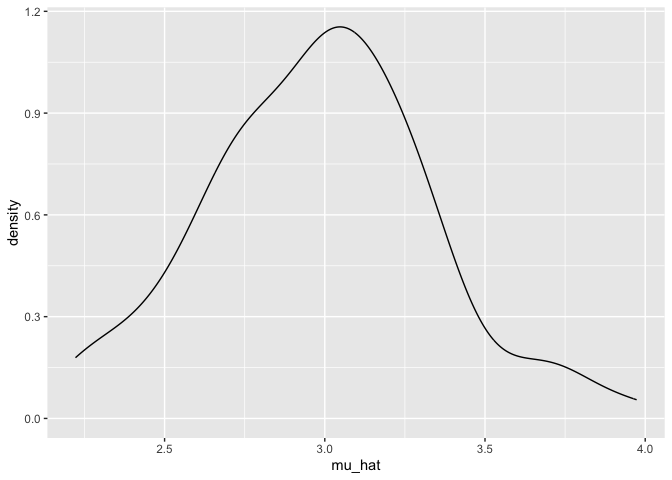
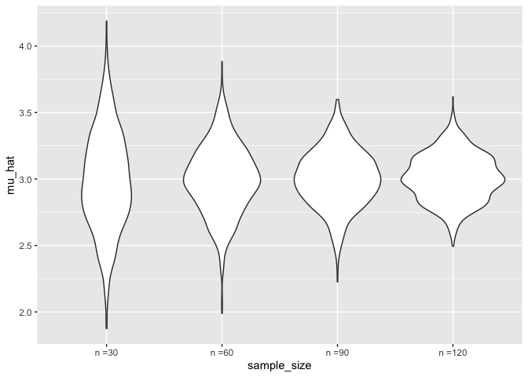
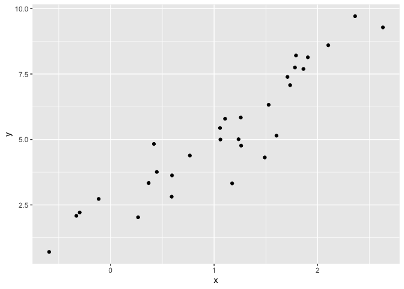
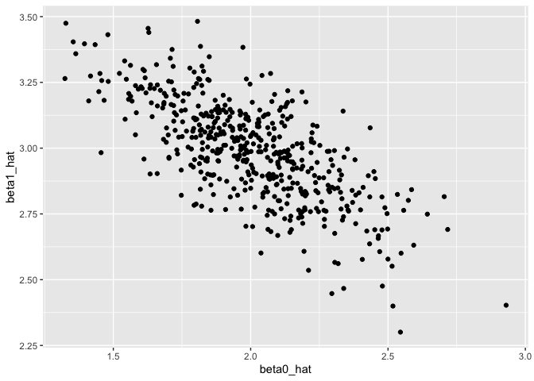

Simulation
================
2025-10-30

load key packages and source necessary files.

``` r
library(tidyverse)
```

    ## ── Attaching core tidyverse packages ──────────────────────── tidyverse 2.0.0 ──
    ## ✔ dplyr     1.1.4     ✔ readr     2.1.5
    ## ✔ forcats   1.0.0     ✔ stringr   1.5.1
    ## ✔ ggplot2   3.5.2     ✔ tibble    3.3.0
    ## ✔ lubridate 1.9.4     ✔ tidyr     1.3.1
    ## ✔ purrr     1.1.0     
    ## ── Conflicts ────────────────────────────────────────── tidyverse_conflicts() ──
    ## ✖ dplyr::filter() masks stats::filter()
    ## ✖ dplyr::lag()    masks stats::lag()
    ## ℹ Use the conflicted package (<http://conflicted.r-lib.org/>) to force all conflicts to become errors

``` r
source("source/sim_mean_sd.R")
```

we can simulate by running our function

``` r
sim_mean_sd(n_subj = 400)
```

    ## # A tibble: 1 × 2
    ##   mu_hat sigma_hat
    ##    <dbl>     <dbl>
    ## 1   3.06      2.09

can I verify the central limit theorem..first with a `for` loop

``` r
output = vector("list", length = 100)

for (i in 1:100) {
  
  output[[i]] = sim_mean_sd(30)
}

output %>% 
  bind_rows() %>% 
  ggplot(aes(x = mu_hat)) +
  geom_density()
```

<!-- -->

let’s try to repeat with `map` statement

``` r
sim_results_df =
  expand_grid(
    iter = 1:100,
    sample_size = 30
  ) %>% 
  mutate(
    results = map(sample_size, sim_mean_sd)
  ) %>% 
  unnest(results)

sim_results_df
```

    ## # A tibble: 100 × 4
    ##     iter sample_size mu_hat sigma_hat
    ##    <int>       <dbl>  <dbl>     <dbl>
    ##  1     1          30   3.04      1.69
    ##  2     2          30   3.08      1.84
    ##  3     3          30   3.22      2.13
    ##  4     4          30   2.84      2.03
    ##  5     5          30   2.99      1.56
    ##  6     6          30   2.85      1.94
    ##  7     7          30   3.61      2.08
    ##  8     8          30   3.40      2.53
    ##  9     9          30   2.44      1.53
    ## 10    10          30   2.92      2.24
    ## # ℹ 90 more rows

``` r
sim_results_df =
  expand_grid(
    iter = 1:1000,
    sample_size = c(30, 60, 90, 120)
  ) %>% 
  mutate(
    results = map(sample_size, sim_mean_sd)
  ) %>% 
  unnest(results)

sim_results_df
```

    ## # A tibble: 4,000 × 4
    ##     iter sample_size mu_hat sigma_hat
    ##    <int>       <dbl>  <dbl>     <dbl>
    ##  1     1          30   2.89      1.65
    ##  2     1          60   3.24      1.94
    ##  3     1          90   3.04      2.11
    ##  4     1         120   3.00      1.84
    ##  5     2          30   3.50      2.14
    ##  6     2          60   3.37      2.22
    ##  7     2          90   2.77      1.85
    ##  8     2         120   2.69      2.02
    ##  9     3          30   2.75      2.05
    ## 10     3          60   2.31      1.87
    ## # ℹ 3,990 more rows

let’s look at this…

``` r
sim_results_df %>% 
  mutate(
    sample_size = str_c("n =", sample_size),
    sample_size = fct_inorder(sample_size)
  ) %>% 
  ggplot(aes(x = sample_size, y = mu_hat)) +
  geom_violin() 
```

<!-- -->

Let’s try to summarize..

``` r
sim_results_df %>% 
  group_by(sample_size) %>% 
  summarise(
    emp_mean = mean(mu_hat),
    emp_sd = sd(mu_hat)
  )
```

    ## # A tibble: 4 × 3
    ##   sample_size emp_mean emp_sd
    ##         <dbl>    <dbl>  <dbl>
    ## 1          30     2.98  0.369
    ## 2          60     3.00  0.259
    ## 3          90     3.00  0.216
    ## 4         120     3.01  0.176

## Simple linear regression

``` r
sim_df = 
  tibble(
  x = rnorm(30, mean = 1, sd = 1),
  y = 2 + 3 * x + rnorm(30, 0, 1)
)

sim_df %>% 
  ggplot(aes(x = x, y = y)) +
  geom_point()
```

<!-- -->

``` r
sir_fit = lm(y ~ x, data = sim_df)

coef(sir_fit)
```

    ## (Intercept)           x 
    ##    2.315252    2.680960

turn this into a function

``` r
sim_reg = function (n_subj, beta_0 = 2, beta_1 = 3) {

sim_df = 
  tibble(
  x = rnorm(30, mean = 1, sd = 1),
  y = beta_0 + beta_1 * x + rnorm(n_subj, 0, 1)
)

sir_fit = lm(y ~ x, data = sim_df)

tibble(
  beta0_hat = coef(sir_fit)[1],
  beta1_hat = coef(sir_fit)[2]
)
}
```

``` r
sim_reg(n_subj = 30)
```

    ## # A tibble: 1 × 2
    ##   beta0_hat beta1_hat
    ##       <dbl>     <dbl>
    ## 1      2.08      3.05

``` r
output = vector("list", length = 500)

for (i in 1:500) {
  
  output[[i]] = sim_reg(n_subj = 30 )
}

output %>% 
  bind_rows()
```

    ## # A tibble: 500 × 2
    ##    beta0_hat beta1_hat
    ##        <dbl>     <dbl>
    ##  1      1.65      3.09
    ##  2      1.77      3.56
    ##  3      1.51      3.48
    ##  4      2.31      2.80
    ##  5      2.00      2.95
    ##  6      1.96      2.92
    ##  7      1.62      3.44
    ##  8      2.15      2.95
    ##  9      2.02      2.87
    ## 10      1.92      3.00
    ## # ℹ 490 more rows

``` r
slr_sim_results_df =
  expand_grid(
    sample_size = 30, 
    iter = 1:500
  ) %>% 
  mutate(
    results = map(sample_size, sim_reg)
  ) %>% 
  unnest(results)

slr_sim_results_df %>% 
  ggplot(aes(x = beta0_hat, y = beta1_hat)) +
  geom_point()
```

<!-- -->

## Another example

`sample(1:365, 5, replace = TRUE)` means you can pick 5 numbers from the
numbers 1 through 5 and `replace` means you can pick the same number
twice.

``` r
birthdays = sample(1:365, 50, replace = TRUE)

repeated_bday = length(unique(birthdays)) < 50

repeated_bday
```

    ## [1] TRUE

put this in a function

``` r
bday_sim = function (n_room) {
  
  birthdays = sample(1:365, n_room, replace = TRUE)

  repeated_bday = length(unique(birthdays)) < n_room

  repeated_bday

}

bday_sim(20)
```

    ## [1] FALSE

note: `map_lgl` change numbers to “TRUE” or “FALSE”

``` r
bday_sim_results = 
  expand_grid(
    bdays = 5:50,
  iter = 1:2500
  ) %>% 
  mutate(
    results = map_lgl(bdays, bday_sim)
  ) %>% 
  group_by(
    bdays
  ) %>% 
  summarise(
    prob_repeat = mean(results)
  )
```

plot this

``` r
bday_sim_results %>% 
  ggplot(aes(x = bdays, y = prob_repeat)) +
  geom_point() +
  geom_line()
```

<!-- -->
